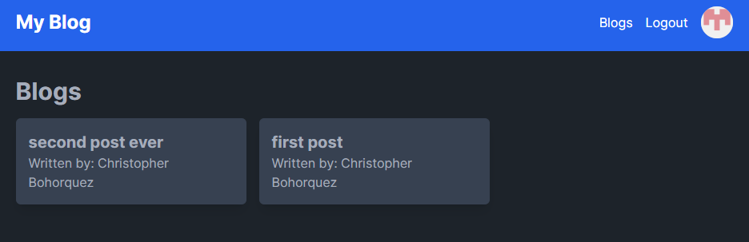
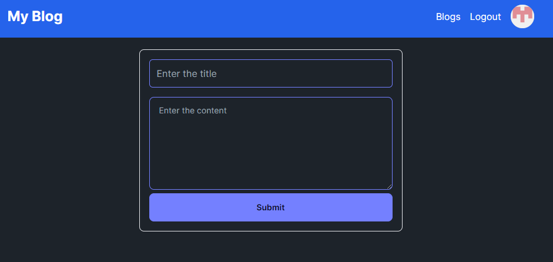

# Blog Application

This Blog Application is a modern web project built with Next.js, a powerful React framework that enables server-side rendering and static site generation for faster, more scalable applications. It leverages the full capabilities of the latest web technologies to provide an outstanding user and developer experience.

The application allows users to create, read, update, and delete blog posts, making it easy to share thoughts, ideas, and stories with a wider audience. It integrates with `next-auth` for secure authentication and `@prisma/client` for robust data management.

This application uses SupaBase for the backend database.
